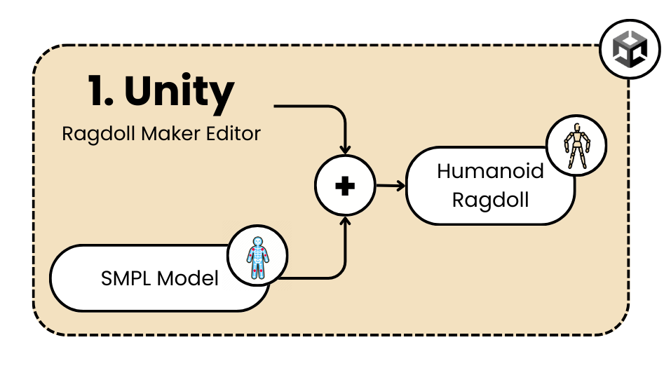

# ragdoll_helper_configurableEdition

> ⚠️ This repository is part of a development project focused on integrating SMPL humanoid models with physically simulated agents. The full project, including training systems and simulation environments, will be.

Unity repository for the automatic generation of a humanoid ragdoll based on `ConfigurableJoint`, designed as an alternative to the [ragdoll\_helper](https://github.com/StasClick/ragdoll_helper?tab=License-1-ov-file) project. The project is organized into several classes, each handling a specific aspect of the ragdoll's physical behavior. This documentation focuses on the classes that allow joint configuration and weight distribution calculation. The ultimate goal is to integrate the SMPL model with a Unity ragdoll to simulate the physical behavior of a mannequin capable of representing different anthropometric percentiles.


<p align="center">
  
</p>

*Figure: The Ragdoll Maker Editor integrates a SMPL humanoid model with a physics-based ragdoll by automatically generating a hierarchy of ConfigurableJoint components. This allows realistic physical interactions inside the Unity environment, enabling simulations for biomechanics or ergonomics.*

### Main Classes:
1. **JointController**: Manages joint configurations, allowing adjustment of joint limits.
2. **WeightCalculator**: Calculates weight distribution for ragdoll components.

## JointController Class

The `JointController` class is responsible for drawing controls for the joint components in the Scene view, allowing developers to visually manipulate joint configurations, including twist and swing limits.

- **Description**: This class provides methods to draw and adjust joint limits such as `highTwistLimit`, `lowTwistLimit`, and `swingLimit`.
- **Main method**: The `DrawControllers()` method is invoked to draw controls for `ConfigurableJoint` components. Through these controls, users can visually adjust joint limits in the Unity Editor.
- **Usage**: This class is essential to configure the movement range of each humanoid ragdoll joint, ensuring realistic physical behavior.

```csharp
public static void DrawControllers(BoneHelper boneHelper, Transform transform)
````

This method handles the drawing of joint controls and interacts with Unity's `ConfigurableJoint` to set the appropriate limits based on user input.

## WeightCalculator Class

The `WeightCalculator` class calculates the weight distribution across various parts of the ragdoll, such as pelvis, chest, arms, and legs. This ensures the ragdoll behaves physically accurately when forces are applied.

* **Description**: This class takes the total character weight and distributes it among body parts. The distribution can be affected by the user's choice to include additional colliders for extremities (like hands and feet).
* **Main properties**:

  * `Pelvis`, `Chest`, `Head`, `Hip`, `Knee`, `Foot`, `Arm`, `Elbow`, `Hand`
    These properties represent the weight assigned to each body part.
* **Usage**: This class is instantiated during ragdoll creation (`Ragdoller.ApplyRagdoll()`), providing mass values for each body part to ensure physically accurate interactions.

```csharp
public WeightCalculator(float totalWeight, bool withTips)
```

This constructor takes the total weight and a boolean indicating whether to include hands and feet, and distributes the weight accordingly.

## RagdollController Class

The `RagdollController` class is responsible for creating and removing ragdoll components for a character.

* **Description**: This class interacts with the `Ragdoller` to add and configure ragdoll components (e.g., joints, colliders) to the character object.
* **Main methods**:

  * `CreateRagdoll()`: Applies ragdoll components to the character, configuring joints and colliders via `Ragdoller`.
  * `RemoveRagdoll()`: Removes all colliders, joints, and rigidbodies from the character.

```csharp
public void CreateRagdoll()
```

This method uses the `Ragdoller` class to apply ragdoll effects to the character, using weights calculated by `WeightCalculator`.

## Ragdoller Class

The `Ragdoller` class handles the application and configuration of ragdoll properties for the humanoid character.

* **Main methods**:

  * `ApplyRagdoll(float totalMass, RagdollProperties ragdollProperties)`: Applies the ragdoll effect to different body parts using properties such as mass, colliders, and joints.
  * `ConfigureJointLimits()`: Configures joint limits across body parts, ensuring realistic movements and stability.
* **Weight distribution**: Uses the `WeightCalculator` to determine the mass of each body part, enabling more realistic physical behavior.

## RagdollProperties Class

The `RagdollProperties` class defines various properties for the ragdoll components, such as whether rigidbodies are kinematic or if gravity should be used.

* **Main properties**:

  * `asTrigger`, `isKinematic`, `useGravity`, `rigidDrag`, `rigidAngularDrag`, `cdMode` (collision detection mode).
* **Usage**: These properties are passed to the `Ragdoller` during ragdoll creation, allowing customization of physical behaviors.

## Summary

* **Joint configuration**: To adjust joint limits, use the `JointController` class. It provides visual tools inside the Unity Editor for setting swing and twist constraints.
* **Weight distribution**: To define the humanoid ragdoll's mass, use the `WeightCalculator`. It ensures that weight is appropriately distributed across the ragdoll for realistic physical interaction.

These classes work together to enable the creation, configuration, and fine-tuning of a physics-driven ragdoll character in Unity, supporting the development of natural and dynamic motion simulations.
